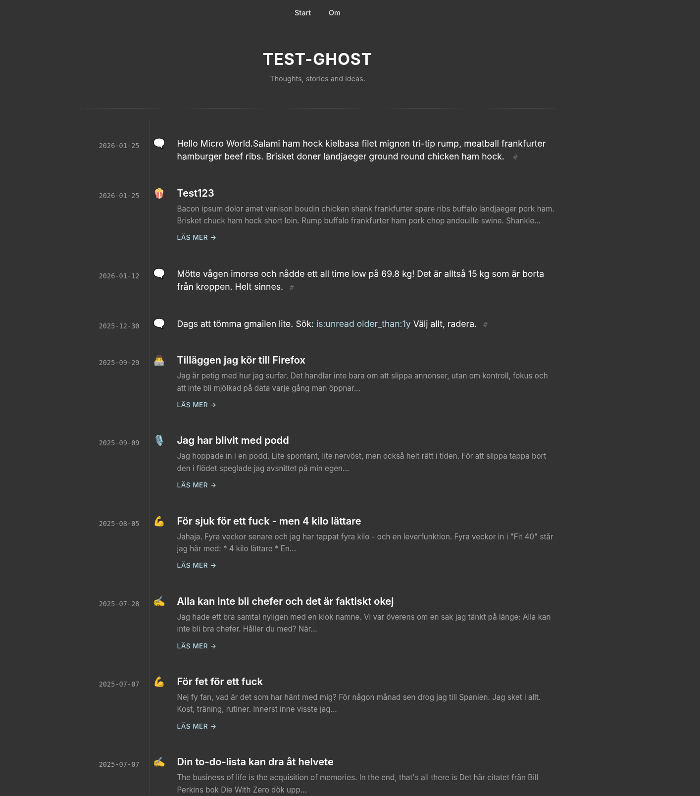

# Tidslinje

[](LICENSE)
[](https://github.com/klppl/tidslinje)

**A minimalist, high-performance Ghost theme featuring a timeline-based post layout.**

Tidslinje is a focused blogging theme optimized for speed, readability, and a unique chronological user experience.



> [!CAUTION]
> **Vibe Disclaimer**: This theme was 100% vibe-coded in collaboration between a human architect and an agentic AI. 
> Expect high-entropy logic, aesthetic-first architecture, and code that technically shouldn't work as well as it does. By using this, you accept that reality is subjective and that "it works on my machine" is a valid deployment strategy.

## 🛠 Project Status: Work in Progress
**Tidslinje is currently under active development.** While it is "good enough" for production (and I use it myself!), expect frequent updates, minor architectural shifts, and the occasional ghost in the machine. Contributions and feedback are welcome as we iterate toward perfection—or at least toward the heat death of the universe.

## Key Features

- **Extreme Performance**: Zero external dependencies, zero JavaScript (default), and optimized for Google Core Web Vitals.
- **Timeline View**: A chronological axis-based post list that emphasizes your content over time.
- **Minimalist Design**: A clean, "rustic" aesthetic that stays out of the way of your words.
- **Privacy First**: No tracking, no analytics, no third-party bloat.

---

## Setup & Customization

### 1. Installation
Compress the theme folder into a `.zip` file and upload it via **Ghost Admin > Settings > Design > Change theme**.

### 2. Primary Configuration
- **Featured Posts**: To keep featured posts pinned to the top, upload the provided `routes.yaml` in **Settings > Labs**.
- **Search**: Enable the portal search by adding a primary navigation item with the label `Search` and URL `#/search`.
- **Comments**: Supports native Ghost comments via **Settings > Membership > Commenting**.

### 3. Customization Options
- **Dynamic Icons**: To change a post's timeline icon, put an emoji in the **Description** of an **Internal Tag** (starts with `#`). If multiple internal tags exist, the first one is used. If empty, it defaults to `✍️`.
- **Typography**: Toggle between Serif, Sans-Serif, and Monospaced system fonts in the Design settings.
- **Welcome Mat**: Enable a full-screen landing page by adding a pitch in the **Welcome mat optin CTA** design field.

### 4. Special Post Types
- **Micro Posts (#micro)**: Tag a post with the internal tag `#micro` to create a title-less status update. These hide the title and "Read more" link, showing the full content with a small `#` permalink at the end. Perfect for quick thoughts or log entries.

### 5. Localization
- **Swedish Support**: Fully localized for Swedish. The theme automatically detects your Ghost site locale (`Settings > General > Publication Language`). Swedish translations are maintained in `locales/sv.json`.

---

## Technical Maintenance

### Build & Release
Use the built-in script to package a clean version of the theme (excludes Git, modules, and system noise):
```bash
npm run zip
```

### CSS Overrides
Override theme variables using **Code Injection**:
```html
<style>
  :root {
    --container-width: 960px;
    --accent-color: #6cb6ff;
  }
</style>
```

## Extensions
Functionality can be extended via these snippets:
- [Navigation Hamburger](https://gist.github.com/curiositry/02332a1b6d5da73ea85c14d623e6b29f)
- [Tag Lists](https://gist.github.com/curiositry/02b9c36234d05a06c574691f2c6ff0e0)

## Roadmap / TODO

- [x] Add a toggle to allow the timeline icon to appear on the left or in its current position.
- [x] Ensure the icon spot can be left blank (no placeholder).
- [ ] Implement a top-row icon filter bar for quick navigation/filtering.
- [ ] **Header Overhaul**: Integrate `@site.icon` as a profile picture with a toggle for circular/square framing.
- [ ] **Navigation Refinement**: Redesign the menu into a sleek bar with better spacing and hover micro-animations.
- [ ] **Sticky Navigation**: Add a setting to keep the header/menu pinned to the top during scroll.
- [ ] **Timeline Entry Animations**: Add subtle fade-in effects for timeline items as they enter the viewport.
- [ ] **Scroll Progress**: Implement a discrete reading progress bar at the top of the page.
- [ ] **Typography Audit**: Optimize line-heights and letter-spacing for the "Monospaced" vibe to ensure maximum readability.
- [x] **Bugfix**: Investigate and fix why `feature_image` is not rendering on post pages.
- [x] **Visibility Toggles**: Add custom settings to show/hide metadata (Author, Tags, Date) in both the post header and footer.
- [ ] **Related Content**: Implement a "Related Posts" section in the footer with a toggle to show/hide it.